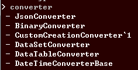

```cs
ImportAssembly("Newtonsoft.Json.dll");
ImportAssembly("Gogi.dll");

// Basic
// TokenMatching
// Deep
var result1 = TypeCandidates("json", SearchDepth.Basic);

var result2 = MemberCandidates("type_name", "tostring", SearchDepth.Basic);
```

Example
----
__basic__<br>
<br>
<br>
<br>
__token matching__<br>
<br>
<br>
<br>
__deep__<br>
<br>
<br>